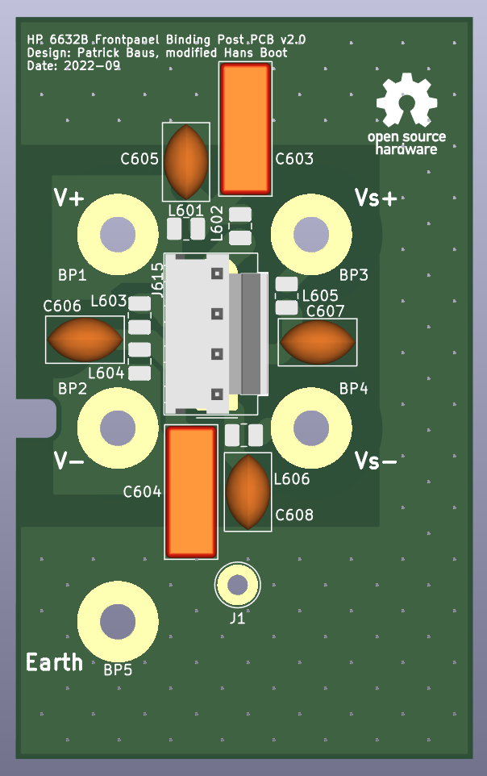
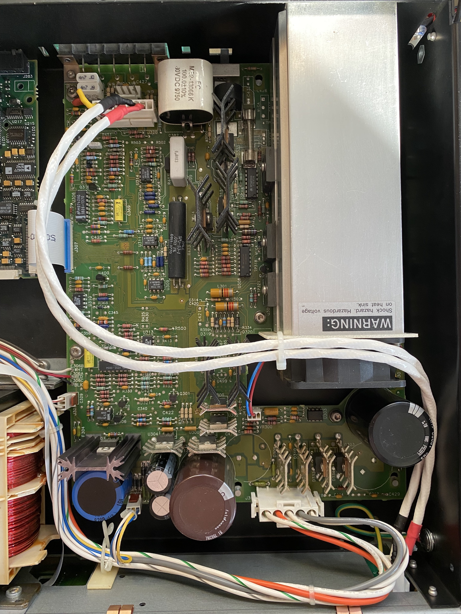

HP 66332A and HP 6632B-6634B Frontpanel Binding Post PCB
===================
This repository contains the schematics for a PCB to mount frontpanel binding post on an HP 6632B (and siblings) power supply. It is an adaption of the original A4 PCB used in option #020 units.

In contrast to the original option #20 PCB, this board breaks out the sense connections as well and also the chassis ground. This makes connecting multiple HP 663xB in parallel possible. On the downside, this requires connecting the sense pins externally.   

The components chosen allow the board to be used on all variants of the HP 663xB family - even the 100 V 6634B. A variety of different binding posts can be used. There are HP/Agilent versions available on Ebay. Examples:
- Pomona 4243-0 ([Digikey](https://www.digikey.de/en/products/detail/pomona-electronics/4243-0/604321) and 3760-5 ([Digikey](https://www.digikey.de/en/products/detail/pomona-electronics/3760-5/736554)).
- EZ-Hook 9406 ([Digikey](https://www.digikey.fr/en/products/detail/e-z-hook/9406/574036)) (only to be found in red and black as a set or individually under the name EZ-Hook 9280BLK or 9280RED)

The final result looks like this:

The following changes were made to Patrick Baus's original version:
- the terminals are moved around to match a more standard layout.
- added documentation about the connectivity to the main board.
- the wire connections are moved to better align with the hole in the chassis behind the posts.
- the slot in the PCB for the front panel fixation screw is widened a bit to allow more freedom.
- newer KiCad version (6.0).
- added a FreeCAD model.

About
-----
The root folder contains the KiCAD files. 
The gerber files can be found in the [/gerber](gerber/) folder. 
A 3D model from FreeCAD can be found in the [/freecad](freecad/) folder. That model was used to determine the placement of the connector and the ground wire.

Related Repositories and info
--------------------

See the following repositories for more information

KiCAD schematic libraries: https://github.com/PatrickBaus/KiCad-libraries

A "HP 66xxA 65xxA PSU Front Panel Binding Post Adapter" plate from [NearFarMedia](https://www.thingiverse.com/thing:4299873) is recommended. It is also included in the FreeCad file. The slots for the binding posts might be a bit tighter, but it works superbly.

I'd also recommend to look at [Barbouri's efforts](https://www.barbouri.com/2021/04/23/hewlett-packard-agilent-6632b-upgrade/) for his upgrade.

You may want to combine this with the [option 760 relay board](https://github.com/hb020/HP6632B_relay_board).

License
-------

This work is released under the Cern OHL v.1.2
See www.ohwr.org/licenses/cern-ohl/v1.2 or the included LICENSE file for more information.
